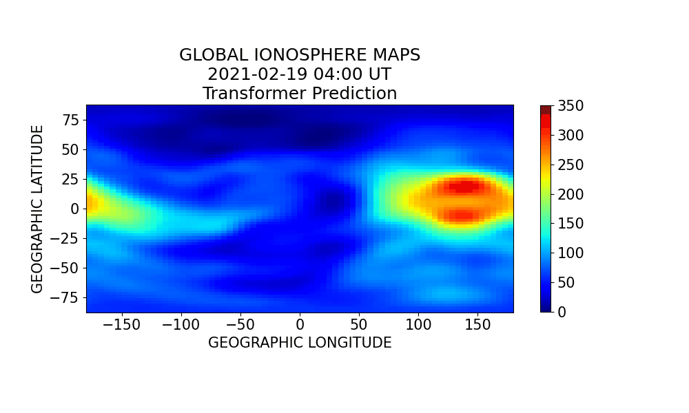

# TEC_prediction

<div align="center">
<p>Using a Transformer-base model to predict global TEC(Total Electron Content)</p>
<p>使用Transformer模型在全球電離層預測</p>
  
</div>

## 訓練
### 指令注釋
` python main.py --epochs 需要的訓練代數 --batch_size 批次數 --train_path 訓練資料路徑 --use_model 使用模型`

ex. 使用 Transformer 模型訓練40代，批次量32；並使用'txt/train'裡的資料進行訓練(此指令會同時進行模型評估)

`python main.py --epochs 40 --batch_size 32 --train_path txt/train --use_model Transformer`

## 其他參數
```
args:
--train_path         訓練資料檔案目錄
--path_save_model    模型位置
--epoch              訓練代數
--path_save_loss     誤差記錄檔位置
--batch_size         訓練批次量
--use_model          使用模型
```

## 檔案
```
/save_model                           儲存模型的目錄

GIM_TXT_to_csv.py                     GIM Map視覺化等工具

helper.py                             誤差、關聯性係數等視覺化工具

train_model.py                        訓練預測模型

main.py                               主程式檔

model.py                              GIM Map 預測模型

inference.py                          評估模型

dataloader.py                         資料載入

```
